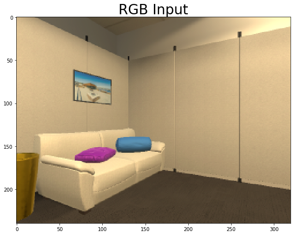
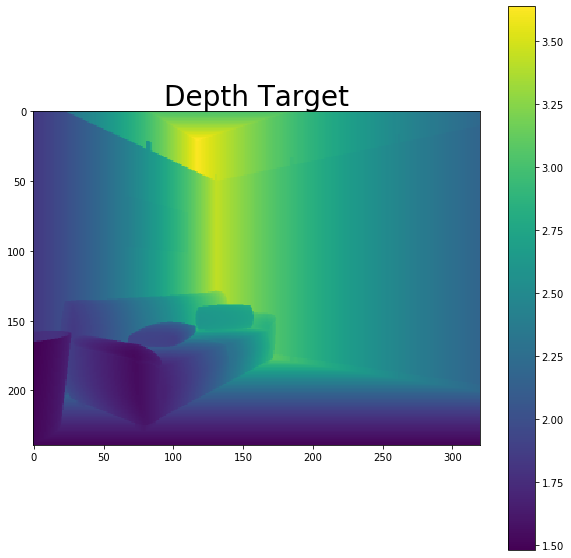
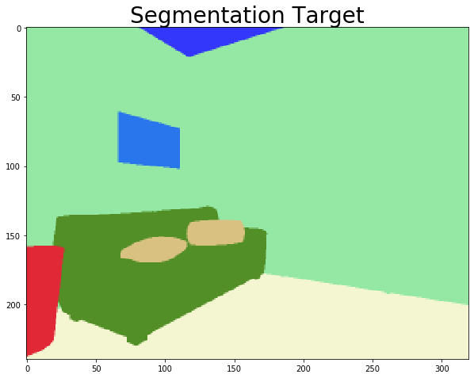

# Robothor Challenge Agents and Training

This repository holds my work on the [Robothor Challenge](https://ai2thor.allenai.org/robothor/challenge/), a robotics contest from the [Allen Institute for Artificial Intelligence](https://allenai.org/)

The challenge is to control a simulated robot platform in a number of simulated apartment settings. The goal is to move the robot into a position where it can see a nearby target object, then signal the end of the episode. More information about the competition and the simulator can be found in the challenge repository: [https://github.com/allenai/robothor-challenge](https://github.com/allenai/robothor-challenge). After working directly in the challenge directory for a while, I decided to split off this repo to keep track of my work on the problem specifically.

## Approach

The Robothor contest isn't strictly a reinforcement learning contest, and in fact it's probably more conducive to applying a combination of machine learning and manual programming. But I still wanted to approach this at least partially from an RL perspectiive, so I built a wrapper for the simulator as [robothor_agents/env.py](https://github.com/riveSunder/RobothorAgents/blob/master/robothor_agents/env.py). The environment incorporates the OpenAI Gym API style, i.e.

```
action = agent.get_action(obs)
obs, reward, done, info = env.step(action)
```

The action space is discrete so I implemented a DQN training loop [here](https://github.com/riveSunder/RobothorAgents/blob/master/robothor_agents/dqn.py) for gathering experience buffers. Simulation in this environment is somewhat slow, but it produces a significant amount of additional data. My approach so far is to use these additional data for off-task training. Some of the data for off-task training is shown below:

<div align="center">
    
    <em>Also included as task-specific input, but is used for autoencoding off-task training</em>
    
    
    
</div>
    
     


